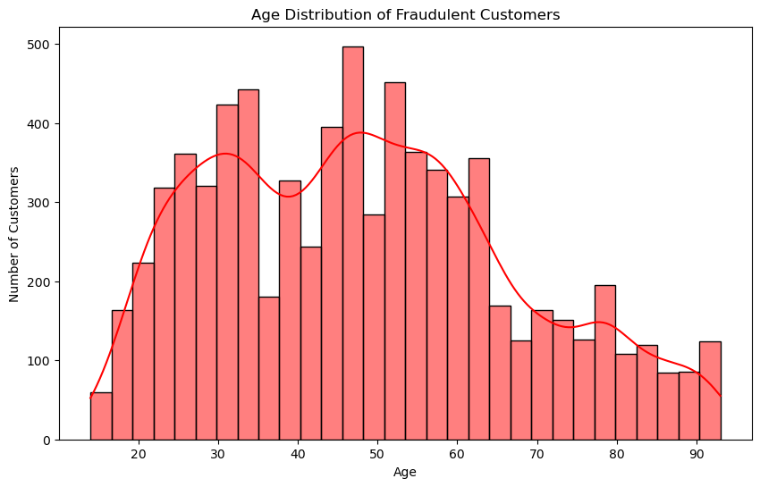
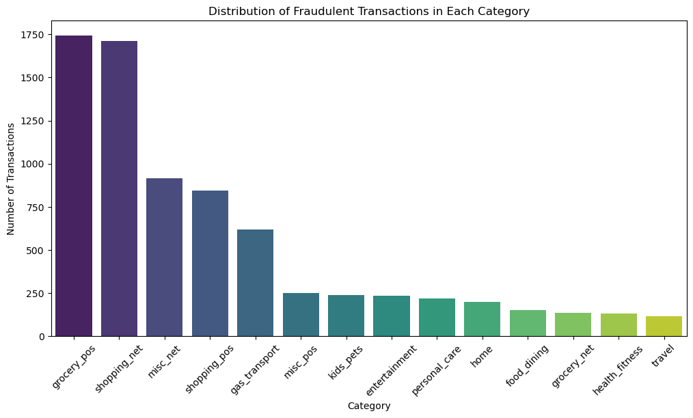
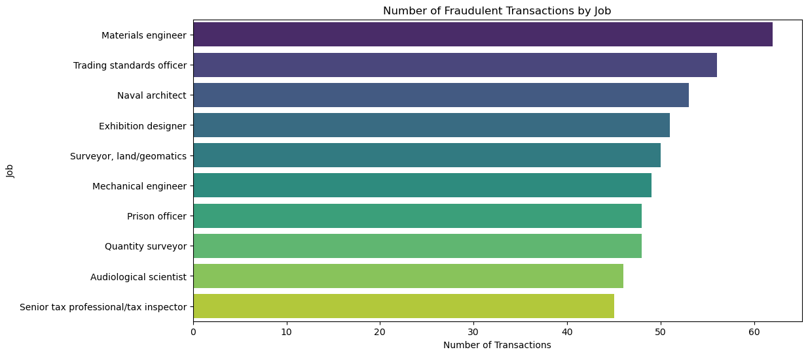

# Credit-Card-Fraud-Detection

Author: Brian Woo

## Business Problem

Financial institutions face significant challenges due to credit card fraud, which leads to substantial financial losses and erodes customer trust. Detecting and preventing fraudulent transactions is essential for protecting both the financial assets of banks and the satisfaction of their customers. The goal of this project is to develop a machine learning model that accurately distinguishes between legitimate and fraudulent transactions by analyzing various features within transaction data. The model will prioritize precision, ensuring that transactions flagged as fraudulent are highly likely to be correct, thereby minimizing false positives and maintaining a positive customer experience. By striking this balance, the model aims to reduce financial losses from fraud while preserving customer trust and satisfaction.

## Data Understanding

[Source](https://www.kaggle.com/datasets/kartik2112/fraud-detection)

Context:
This dataset is a simulated representation of credit card transactions, covering both legitimate and fraudulent activities. The data spans from January 1, 2019, to December 31, 2020, and includes transactions made by 1,000 customers with a pool of 800 merchants. The dataset is designed to closely mimic real-world credit card transaction patterns, making it suitable for training and evaluating fraud detection models.

Source of Simulation:
The dataset was generated using the "Sparkov Data Generation" tool, created by Brandon Harris and available on GitHub. The simulation was conducted for the specified time period, and the generated data files were subsequently combined and standardized to create a cohesive dataset.

Simulator Information:
The Sparkov Data Generation tool uses a predefined list of merchants, customers, and transaction categories. It leverages the "faker" library in Python to simulate realistic transaction data based on user-defined profiles. For example, a profile like "adults 25-50 female rural" would simulate transactions for adult females aged 25-50 living in rural areas. This profile specifies parameters such as the number of transactions per day, distribution across days of the week, and statistical properties (mean, standard deviation) for transaction amounts in various categories. The simulation process generates transactions based on these distributions, creating data that reflects the behavior of different demographic groups. The final dataset used in this project was created by generating transactions across multiple profiles and merging them to produce a more comprehensive and realistic representation of credit card transaction activity.

***Acknowledgements:***

A special thanks to Brandon Harris for developing the Sparkov Data Generation tool, which made it possible to create this simulated fraud transaction dataset. This tool provided an easy-to-use platform for generating realistic transaction data for fraud detection projects.

## Data Preparation

1. Load the Data
2. Data Cleaning
    - Assign proper dtypes to columns
    - Check for missingness and duplicates
    - Handle missing values appropriately
    - Check for outliers
    - Determine correlation matrices
3. Data Transformation
    - Standardize Data
    - One Hot Encode categorical features
4. Feature Engineering
    - City population to extra small, small, medium, large, extra large
    - Combined job types by keywords
    - Age at transaction
    - Average transaction amount
    - Unique transaction in a day
    - Transaction sequence
    - Calculate time since last transaction
    - Calculate distance between user location and merchant location

## Findings

There is a significant class imbalance in this dataset. So I decided to manually randomly undersample the dataset to balance the target class

The average age of fraudulent customers peak twice. First the age of fraudulent customers grows and it peaks at 25-35 and at 45-55. Then there is a gradual decrease as the age gets older.

We can see here that customers tend to stick to a certain category when using fraud credit cards.

Even though grocery_pos has the most frauds, but it is not the most expensive. Some categories are more expensive than others.

There is no significant difference in fraud male and female customers.

Here we can see that certain jobs tend to engage in fraudulent transactions by jobs.

This shows the states that have the most fraudulent transactions.

Here we can see that most of the fraudulent credit cards are active around 22:00pm - 03:00am

## Models

All of the models below were ran under the same grid search of 5 cross fold validations, scoring of "precision", with their respective parameter grids for tuning. Each of the models were tested on their precision, recall, and f1-scores to determine which are the best.

    1. Logistic Regression
    2. XGBoost
    3. LightGBM
    4. Random Forest
    5. Support Vector Machines

## Conclusions

Best Model: XGBoost

- Training Precision Score: 0.9985, Test Precision Score: 0.9875
- Training Recall Score: 0.9985, Test Recall Score: 0.9858
- Training F1 Score: 0.9985, Test F1 Score: 0.9867
